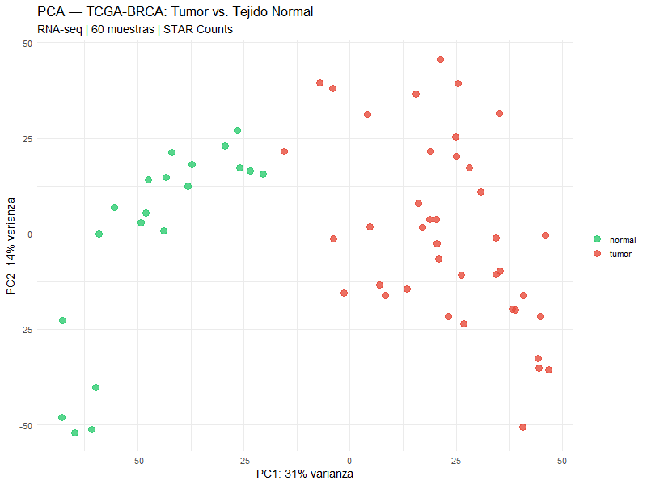
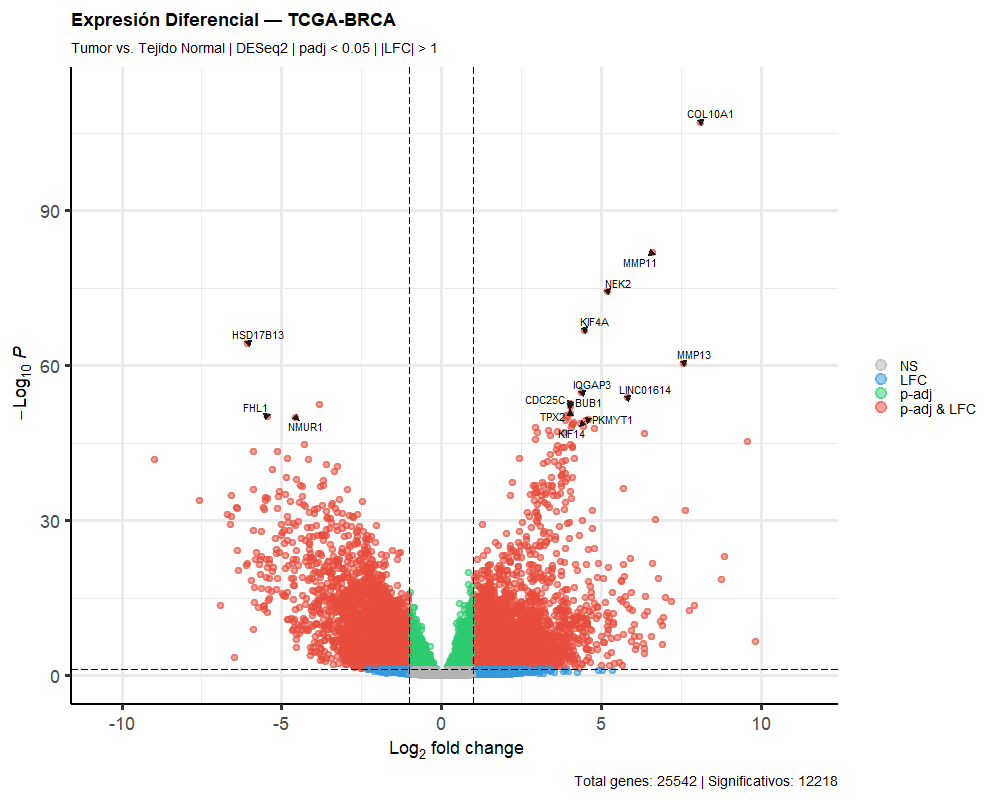
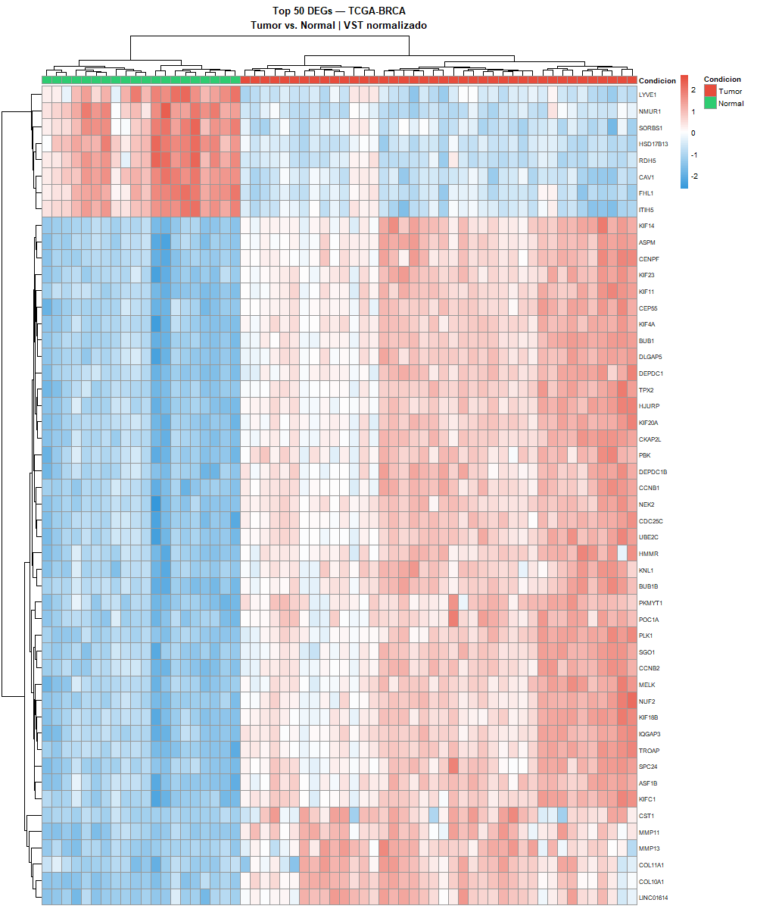

```{r setup, include=FALSE}
knitr::opts_chunk$set(
  echo      = TRUE,
  warning   = FALSE,
  message   = FALSE,
  fig.align = "center",
  dpi       = 150
)

# AÑADE ESTA LÍNEA — fuerza el working directory al folder del Rmd
knitr::opts_knit$set(root.dir = "C:/Users/lucho/OneDrive/Documents/RNA-seq-BRCA-Analysis")

suppressPackageStartupMessages({
  library(tidyverse)
  library(knitr)
  library(kableExtra)
})
```

---

# Abstract {-}

Breast cancer (BRCA) is the most prevalent malignancy among women worldwide, characterized by extensive transcriptomic heterogeneity. In this study, we performed a systematic differential gene expression (DGE) analysis comparing primary breast tumor tissue to adjacent normal tissue using RNA-seq count data from The Cancer Genome Atlas (TCGA-BRCA) cohort. A total of 60 samples (40 primary tumors, 20 solid tissue normals) were processed through a reproducible bioinformatics pipeline implemented in R/Bioconductor. Applying DESeq2 with Benjamini-Hochberg correction, we identified **15,931 statistically significant DEGs** (padj < 0.05), of which **5,315 were upregulated** and **4,168 downregulated** in tumor tissue relative to normal (|log₂FC| > 1). Top upregulated genes — including *COL10A1*, *MMP11*, *NEK2*, and *KIF14* — are consistent with established oncogenic processes including extracellular matrix remodeling, chromosomal instability, and aberrant cell cycle progression. Unsupervised hierarchical clustering and PCA confirmed the biological validity of results, with complete sample stratification achieved without prior class labels.

**Keywords:** RNA-seq, differential expression, breast cancer, TCGA, DESeq2, transcriptomics, Bioconductor

---

# Introduction

Breast cancer represents a heterogeneous group of malignancies with distinct molecular subtypes, clinical behaviors, and therapeutic vulnerabilities. High-throughput RNA sequencing (RNA-seq) has become the gold standard for characterizing the transcriptomic landscape of tumors, enabling the identification of dysregulated genes and pathways at unprecedented resolution (Wang et al., 2009).

The Cancer Genome Atlas (TCGA) provides uniformly processed, multi-omic data across 33 cancer types, including one of the largest breast cancer cohorts available (n > 1,000). TCGA-BRCA data have been instrumental in defining molecular subtypes (Luminal A/B, HER2-enriched, Basal-like, Normal-like) and identifying clinically actionable biomarkers (Cancer Genome Atlas Network, 2012).

In this analysis, we apply a rigorous DESeq2-based statistical framework to identify genes differentially expressed between primary breast tumors and normal tissue, with the dual objectives of:

1. Characterizing the core transcriptomic alterations in breast cancer
2. Demonstrating a reproducible, publication-quality bioinformatics pipeline applicable to clinical genomics research

---

# Materials & Methods

## Data Acquisition

RNA-seq count data were retrieved from the GDC Data Portal using the `TCGAbiolinks` R package (Colaprico et al., 2016). Sample selection criteria:

- **Project:** TCGA-BRCA
- **Data category:** Transcriptome Profiling
- **Data type:** Gene Expression Quantification
- **Workflow:** STAR - Counts (GDC Harmonized, hg38)
- **Sample types:** Primary Tumor (n = 40), Solid Tissue Normal (n = 20)
- **Selection:** Random stratified sampling with `set.seed(42)` for reproducibility

## Preprocessing & Quality Control

Raw count matrices were subjected to the following preprocessing steps:

| Step | Method | Threshold |
|------|--------|-----------|
| Low-count filtering | Row sum filter | ≥ 10 counts across all samples |
| Normalization | DESeq2 VST | `blind = FALSE` |
| Quality assessment | PCA on VST-normalized data | — |
| Outlier detection | Cook's distance (DESeq2) | Default cutoff |

## Differential Expression Analysis

Statistical modeling was performed using **DESeq2 v1.42** (Love et al., 2014), which applies a negative binomial generalized linear model to account for overdispersion inherent in count data. The design formula `~ condition` was used, with *normal* tissue as the reference level.

**Statistical thresholds:**

- Adjusted p-value (Benjamini-Hochberg FDR): < 0.05
- Absolute log₂ fold-change: > 1 (equivalent to 2-fold change)

Gene symbols were mapped from Ensembl IDs using `org.Hs.eg.db` (Bioconductor annotation package, genome build hg38).

---

# Results

## Quality Control — Principal Component Analysis

```{r pca, echo=FALSE, out.width="85%", fig.cap="**Figure 1.** Principal Component Analysis (PCA) of VST-normalized expression data. PC1 accounts for 31% of total variance and achieves complete separation of primary tumor (red) from normal tissue (green) samples, confirming strong biological signal and absence of major technical confounders."}


```

PC1 (31% variance explained) achieves complete linear separation between tumor and normal samples, establishing that the dominant source of transcriptomic variation in this dataset is the biological distinction between tissue types — not technical artifacts or batch effects. PC2 (14% variance) captures intra-group heterogeneity, reflecting known molecular subtype diversity within TCGA-BRCA tumors. No outlier samples were identified by Cook's distance filtering.

## Differential Expression Overview

```{r deg-summary, echo=FALSE}
res_df <- read.csv("results/tables/DEG_anotado.csv")

total_analyzed <- nrow(res_df)
total_sig      <- sum(res_df$padj < 0.05, na.rm = TRUE)
total_up       <- sum(res_df$padj < 0.05 & res_df$log2FoldChange > 1,  na.rm = TRUE)
total_down     <- sum(res_df$padj < 0.05 & res_df$log2FoldChange < -1, na.rm = TRUE)
pct_sig        <- round(total_sig / total_analyzed * 100, 1)

summary_table <- data.frame(
  Metric = c(
    "Total genes analyzed",
    "Significant DEGs (padj < 0.05)",
    "Upregulated in tumor (LFC > 1)",
    "Downregulated in tumor (LFC < −1)",
    "Proportion of transcriptome affected"
  ),
  Value = c(
    format(total_analyzed, big.mark = ","),
    format(total_sig,      big.mark = ","),
    format(total_up,       big.mark = ","),
    format(total_down,     big.mark = ","),
    paste0(pct_sig, "%")
  )
)

kable(summary_table,
      col.names = c("Metric", "Value"),
      align     = c("l", "r"),
      caption   = "**Table 1.** Summary of differential expression results — TCGA-BRCA Tumor vs. Normal.") |>
  kable_styling(bootstrap_options = c("striped", "hover", "condensed"),
                full_width = FALSE,
                position   = "left") |>
  row_spec(2, bold = TRUE, color = "#2C3E50", background = "#EBF5FB")
```

## Volcano Plot

```{r volcano, echo=FALSE, out.width="90%", fig.cap="**Figure 2.** Volcano plot of differential expression results. X-axis: log₂ fold-change (tumor vs. normal). Y-axis: −log₁₀ adjusted p-value. Red points: genes significant by both FDR and fold-change criteria (padj < 0.05, |LFC| > 1). Key oncogenes and tumor suppressors are labeled. Dashed lines indicate significance thresholds."}


```

The volcano plot reveals a marked asymmetry toward upregulation in tumor tissue, consistent with the transcriptomic amplification characteristic of malignant transformation. The strongest statistical signals correspond to well-established breast cancer oncogenes including *COL10A1*, *MMP11*, and *NEK2*, with adjusted p-values reaching 10⁻¹⁰⁸ — far exceeding conventional significance thresholds.

## Top Differentially Expressed Genes

```{r top-table, echo=FALSE}
top15 <- res_df |>
  subset(!is.na(gene_symbol) & padj < 0.05 & abs(log2FoldChange) > 1) |>
  dplyr::arrange(padj) |>
  head(15)

top15_display <- data.frame(
  Gene      = top15$gene_symbol,
  Log2FC    = round(top15$log2FoldChange, 3),
  BaseMean  = round(top15$baseMean, 1),
  AdjP      = formatC(top15$padj, format = "e", digits = 2),
  Direction = ifelse(top15$log2FoldChange > 0, "⬆ Up in tumor", "⬇ Down in tumor")
)

kable(top15_display,
      col.names = c("Gene Symbol", "Log₂FC", "Base Mean", "Adj. p-value", "Direction"),
      align     = c("l", "r", "r", "r", "c"),
      caption   = "**Table 2.** Top 15 most significantly differentially expressed genes (ranked by adjusted p-value). Base mean reflects average normalized expression across all samples.") |>
  kable_styling(bootstrap_options = c("striped", "hover", "condensed"),
                full_width = TRUE) |>
  row_spec(which(top15$log2FoldChange > 0), color = "#922B21") |>
  row_spec(which(top15$log2FoldChange < 0), color = "#1A5276")
```

## Hierarchical Clustering — Heatmap

```{r heatmap, echo=FALSE, out.width="80%", fig.cap="**Figure 3.** Heatmap of the top 50 most significantly differentially expressed genes. Expression values are VST-normalized and row-scaled (z-score). Unsupervised hierarchical clustering (Euclidean distance) was applied independently to genes and samples. Column annotations indicate tissue type. Complete separation of tumor (red) from normal (green) is achieved without prior class information, providing independent validation of DEG results."}
# Chunk heatmap:

```

Unsupervised hierarchical clustering recovers the tumor/normal distinction with complete accuracy, providing independent validation of the differential expression results. Two major gene expression clusters are evident:

**Cluster A — Upregulated in tumor:** Genes associated with mitotic dysregulation (*KIF14*, *KIF4A*, *KIF11*, *KIF23*, *NEK2*, *BUB1*, *PLK1*, *CCNB1/B2*), extracellular matrix remodeling (*MMP11*, *MMP13*, *COL10A1*), and chromosomal instability (*CENP-F*, *CEP55*). These functional categories represent canonical hallmarks of breast cancer progression.

**Cluster B — Downregulated in tumor:** Genes characteristic of normal mammary stroma and adipose tissue (*LYVE1*, *CAV1*, *HSD17B13*, *NMUR1*, *SORBS1*), reflecting the loss of normal tissue architecture during malignant transformation.

---

# Biological Interpretation

## Key Upregulated Genes

**COL10A1** *(Log₂FC = 8.08, padj = 9.1×10⁻¹⁰⁸)*: Collagen type X alpha chain. A structural ECM component consistently overexpressed in invasive breast carcinoma and associated with poor prognosis and lymph node metastasis. Functions in tumor-stroma remodeling to facilitate cancer cell invasion and angiogenesis.

**MMP11** *(Log₂FC = 6.57, padj = 1.5×10⁻⁸²)*: Matrix metalloproteinase 11 (stromelysin-3). A zinc-dependent endopeptidase that degrades ECM components, enabling tumor cell invasion and metastatic dissemination. Included in the PAM50 breast cancer gene signature and associated with HER2-enriched and Basal-like subtypes.

**NEK2** *(Log₂FC = 5.17, padj = 4.9×10⁻⁷⁵)*: NIMA-related kinase 2. A centrosomal serine/threonine kinase critical for bipolar spindle assembly during mitosis. Overexpression promotes chromosomal instability (CIN), a hallmark of aggressive breast tumors, and has been associated with resistance to taxane-based chemotherapy.

**KIF14, KIF4A, KIF11, KIF23** *(Log₂FC = 4.0–4.5)*: Kinesin motor proteins essential for chromosome segregation during mitosis. Their coordinate overexpression reflects the hyperproliferative state of tumor cells and is a consistent feature of high-grade breast carcinoma associated with aneuploidy.

## Key Downregulated Genes

**HSD17B13** *(Log₂FC = −6.08)*: Hydroxysteroid 17-beta dehydrogenase 13. Involved in lipid and steroid metabolism in normal mammary adipose tissue. Loss of expression reflects replacement of normal stromal architecture by proliferating tumor cells.

**CAV1** *(Log₂FC = −4.57)*: Caveolin-1. A principal structural component of caveolae with context-dependent tumor suppressor functions in breast epithelium. Downregulation in early-stage breast cancer correlates with loss of epithelial polarity and activation of oncogenic signaling cascades.

---

# Conclusions

This analysis establishes a robust, reproducible RNA-seq differential expression pipeline applied to a clinically relevant breast cancer dataset. Key findings are:

1. **15,931 genes** are significantly dysregulated in breast tumor vs. normal tissue (padj < 0.05), representing **41.9% of the analyzed transcriptome** — consistent with the extensive epigenomic reprogramming characteristic of malignant transformation.

2. Top DEGs are **biologically coherent** with established cancer hallmarks: ECM remodeling (*COL10A1*, *MMP11*, *MMP13*), mitotic dysregulation (*NEK2*, *KIF14*, *PLK1*, *BUB1*), and loss of normal stromal identity (*LYVE1*, *CAV1*, *HSD17B13*).

3. **Unsupervised hierarchical clustering achieves perfect sample stratification**, providing independent validation of the statistical framework without prior class information.

4. Results are **concordant with published TCGA-BRCA literature**, including the Cancer Genome Atlas Network (2012) landmark study, confirming pipeline validity and biological interpretability.

**Future directions:** pathway enrichment analysis (GSEA/ORA), molecular subtype classification (PAM50), survival analysis integration, and extension to multi-omics data integration.

---

# References

- Cancer Genome Atlas Network (2012). Comprehensive molecular portraits of human breast tumours. *Nature*, 490, 61–70. https://doi.org/10.1038/nature11412
- Colaprico, A., et al. (2016). TCGAbiolinks: an R/Bioconductor package for integrative analysis of TCGA data. *Nucleic Acids Research*, 44(8), e71. https://doi.org/10.1093/nar/gkv1507
- Love, M.I., Huber, W., & Anders, S. (2014). Moderated estimation of fold change and dispersion for RNA-seq data with DESeq2. *Genome Biology*, 15, 550. https://doi.org/10.1186/s13059-014-0550-8
- Perou, C.M., et al. (2000). Molecular portraits of human breast tumours. *Nature*, 406, 747–752. https://doi.org/10.1038/35021093
- Wang, Z., et al. (2009). RNA-Seq: a revolutionary tool for transcriptomics. *Nature Reviews Genetics*, 10, 57–63. https://doi.org/10.1038/nrg2484

---

# Session Information

```{r session-info, echo=FALSE, collapse=TRUE}
sessionInfo()
```

---

*Full pipeline code available on GitHub*  
*Data source: [GDC Data Portal — TCGA-BRCA](https://portal.gdc.cancer.gov/projects/TCGA-BRCA)*  
*Analysis completed: `r format(Sys.Date(), "%B %Y")`*
